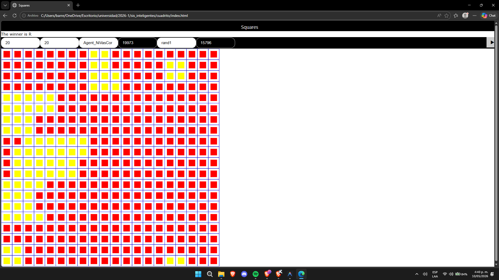

# Agente Cuadrito: Agent_NiVasCor

Este archivo contiene la implementación de `Agent_NiVasCor`, un agente inteligente desarrollado en JavaScript para jugar "Cuadrito" (Dots and Boxes). Está optimizado para un entorno con mecánicas de auto-captura en cadena y un límite de tiempo global estricto.

## 👥 Miembros del Equipo

* **Pablo Andres Niño Barreto** - [pninob@unal.edu.co](mailto:pninob@unal.edu.co)
* **Sergio Tovar Vásquez** - [setovarv@unal.edu.co](mailto:setovarv@unal.edu.co)
* **Alejandro Ortiz Cortés** - [alortizco@unal.edu.co](mailto:alortizco@unal.edu.co)

---

## 🧠 Explicación del Código y Estrategia

El agente hereda de la clase `Agent` y sobreescribe el método `compute` para decidir la mejor jugada posible en cada turno. El objetivo principal es sobrevivir el mayor tiempo posible sin regalar cuadros al oponente y, cuando el sacrificio es inevitable, entregar la menor cantidad de puntos posibles.

### Clasificación de Movimientos
Para evitar el alto costo computacional de clonar el tablero repetidamente, el agente encuentra y evalúa los movimientos válidos directamente sobre la matriz actual. Las jugadas se dividen en tres categorías estratégicas:

* **`safe0` (Excelente):** Movimientos inofensivos que no crean celdas de 2 lados, evitando armar trampas a futuro.
* **`safe1` (Aceptable):** Movimientos seguros a corto plazo. Crean celdas de 2 lados, pero no le regalan el cuadro inmediatamente al rival.
* **`risky` (Peligroso):** Movimientos de sacrificio que convierten una celda de 2 lados en una de 3, activando la captura en cadena por parte del oponente.

### Lógica de Decisión y Mitigación de Daños
El agente sigue un sistema de prioridades estricto durante la fase de cálculo en `compute`:

1. **Prioridad 1:** Juega un movimiento `safe0` aleatorio si está disponible.
2. **Prioridad 2:** Si no hay opciones excelentes, juega un movimiento `safe1` aleatorio.
3. **Prioridad 3 (Fase Final):** Cuando solo quedan opciones `risky`, el agente calcula el costo del sacrificio. Utiliza el método `chainLength` para medir el tamaño de la cadena de cuadros que le regalará al rival. Finalmente, elige el movimiento que garantice la cadena más pequeña (el mal menor).
---

## 🏆 Prueba de Ejecución

A continuación se muestra una captura de pantalla del agente en funcionamiento dentro del entorno gráfico del juego:

